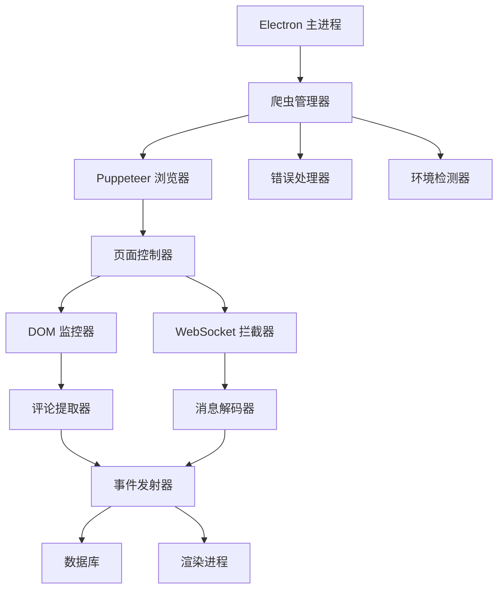

# 设计文档

## 概述

本设计解决了阻止 Electron 应用程序成功启动抖音爬虫的关键问题。识别出的主要问题包括：

1. **Puppeteer 配置问题**：当前爬虫使用的设置与 Electron 环境不兼容
2. **模块加载问题**：ES 模块导入在打包的 Electron 应用中可能失败
3. **浏览器启动失败**：硬编码的 Chrome 路径和不当的启动选项
4. **错误处理缺陷**：错误处理和恢复机制不足
5. **DOM 选择器问题**：评论提取的 CSS 选择器过时或不正确

## 架构

### 组件概述



### 关键设计决策

1. **环境感知配置**：检测 Electron 环境并相应调整 Puppeteer 设置
2. **备用浏览器策略**：多个浏览器可执行路径的优雅回退
3. **健壮的错误处理**：全面的错误捕获和有意义的用户反馈
4. **模块化架构**：分离关注点以便于测试和维护

## 组件和接口

### 1. 环境检测器

**目的**：检测运行时环境并提供适当的配置

```javascript
interface EnvironmentConfig {
  isElectron: boolean;
  isDevelopment: boolean;
  isPackaged: boolean;
  platform: string;
  chromePaths: string[];
}
```

**关键方法**：
- `detectEnvironment()`：返回环境配置
- `getPuppeteerOptions()`：返回特定环境的 Puppeteer 启动选项
- `getBrowserExecutablePaths()`：返回要尝试的浏览器路径有序列表

### 2. 增强的爬虫管理器

**目的**：通过改进的错误处理管理爬虫生命周期

```javascript
interface CrawlerManager {
  startMonitoring(url: string): Promise<void>;
  stopMonitoring(): Promise<void>;
  getStatus(): CrawlerStatus;
  restart(): Promise<void>;
}
```

**关键特性**：
- 浏览器启动失败的重试机制
- 健康监控和自动恢复
- 功能失败时的优雅降级

### 3. 浏览器控制器

**目的**：处理具有 Electron 兼容性的 Puppeteer 浏览器生命周期

```javascript
interface BrowserController {
  launch(): Promise<Browser>;
  createPage(): Promise<Page>;
  configurePage(page: Page): Promise<void>;
  cleanup(): Promise<void>;
}
```

**配置策略**：
- Electron 特定的启动选项
- 多个浏览器可执行文件回退
- 无头模式检测和配置

### 4. DOM 评论提取器

**目的**：使用多种选择器策略提取评论

```javascript
interface CommentExtractor {
  extractLastComment(): Promise<Comment | null>;
  extractAllComments(): Promise<Comment[]>;
  waitForCommentContainer(): Promise<boolean>;
}
```

**选择器策略**：
- 主要：`webcast-chatroom___content-with-emoji-text`
- 备用：针对不同页面布局的多种选择器模式
- 动态选择器发现

## 数据模型

### 评论模型

```javascript
interface Comment {
  id: string;
  username: string;
  content: string;
  timestamp: number;
  source: 'dom' | 'websocket';
  live_url: string;
  user_id?: string;
  level?: number;
  message_type?: string;
}
```

### 爬虫状态模型

```javascript
interface CrawlerStatus {
  status: 'idle' | 'connecting' | 'monitoring' | 'error' | 'stopped';
  error?: string;
  url?: string;
  browserConnected: boolean;
  pageLoaded: boolean;
  websocketConnected: boolean;
}
```

### 环境配置模型

```javascript
interface PuppeteerConfig {
  headless: boolean | 'new';
  args: string[];
  executablePath?: string;
  timeout: number;
  ignoreHTTPSErrors: boolean;
  defaultViewport: ViewportOptions | null;
}
```

## 错误处理

### 错误类别

1. **浏览器启动错误**
   - 找不到 Chrome/Chromium
   - 权限问题
   - 资源约束

2. **页面导航错误**
   - 网络超时
   - 无效 URL
   - 页面加载失败

3. **DOM 提取错误**
   - 找不到选择器
   - 内容解析失败
   - 页面结构变化

4. **WebSocket 错误**
   - 连接失败
   - 消息解码错误
   - 协议变化

### 错误恢复策略

1. **浏览器启动**：尝试多个可执行路径，调整启动选项
2. **页面导航**：使用指数退避重试，回退到缓存内容
3. **DOM 提取**：使用多种选择器策略，优雅降级
4. **WebSocket**：回退到 DOM 轮询，重连尝试

### 错误报告

```javascript
interface ErrorReport {
  category: string;
  message: string;
  stack?: string;
  context: {
    environment: EnvironmentConfig;
    url?: string;
    timestamp: number;
  };
  recovery?: {
    attempted: string[];
    successful?: string;
  };
}
```

## 测试策略

### 单元测试

1. **环境检测**
   - 测试环境检测准确性
   - 验证配置生成
   - 模拟不同的运行时环境

2. **浏览器控制器**
   - 测试启动选项生成
   - 模拟浏览器启动失败
   - 验证清理程序

3. **评论提取**
   - 测试选择器策略
   - 模拟不同的 DOM 结构
   - 验证评论解析准确性

### 集成测试

1. **Electron 环境**
   - 在打包的 Electron 应用中测试
   - 验证 IPC 通信
   - 在 Electron 上下文中测试浏览器启动

2. **实时页面测试**
   - 针对实际抖音直播页面测试
   - 验证评论提取准确性
   - 测试 WebSocket 拦截

### 错误场景测试

1. **浏览器启动失败**
   - Chrome 未安装
   - 权限被拒绝
   - 资源耗尽

2. **网络问题**
   - 连接超时
   - DNS 解析失败
   - 代理干扰

3. **页面结构变化**
   - 修改的 CSS 选择器
   - 动态内容加载
   - 反机器人措施

## 性能考虑

### 内存管理

- 适当的浏览器和页面清理
- 事件监听器管理
- WebSocket 数据的缓冲区处理

### 资源使用

- 生产环境的无头模式
- 优化的浏览器参数
- 高效的 DOM 查询

### 可扩展性

- 单个浏览器实例重用
- 多流的页面池
- 高效的事件处理

## 安全考虑

### 浏览器安全

- 禁用不必要的功能
- 沙箱配置
- 用户代理伪装

### 数据隐私

- 安全的评论存储
- 用户数据匿名化
- 遵守平台条款

### 反检测

- 隐身模式配置
- 类人交互模式
- 速率限制和延迟